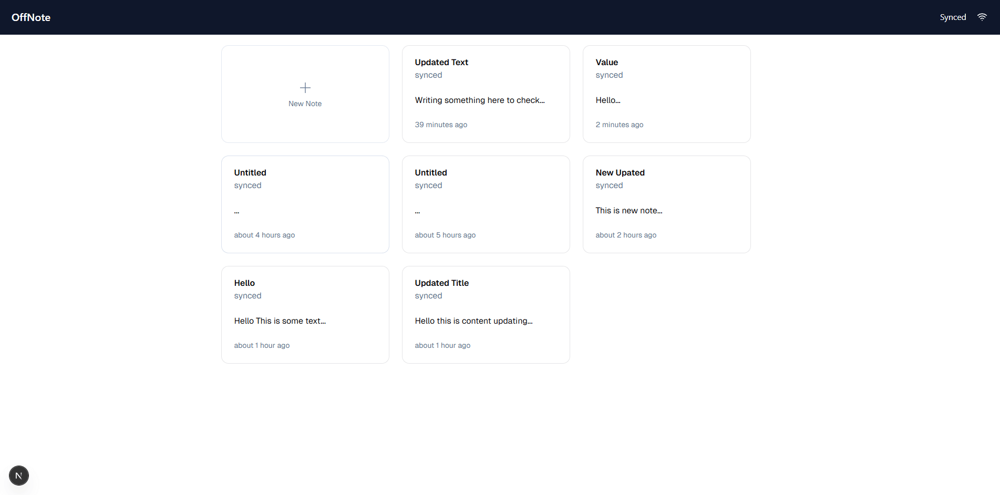

# OffNote

A Simple Offline first Note taking application with Markdown support. OffNote supports auto save so that you never loose your work, even when you loose your network.

## Screenshot



## Intallations and Setup

This is a [Next.js](https://nextjs.org) project bootstrapped with [`create-next-app`](https://nextjs.org/docs/app/api-reference/cli/create-next-app).

Get started by cloning the GitHub repo

```bash
git clone https://github.com/thesevenn/offnote.git
cd offnote
pnpm install
# or
npm install
```

To run the development server

```bash
pnpm run dev
# or
yarn dev
# or
npm run dev
```

Open [http://localhost:3000](http://localhost:3000) with your browser to see the result.

## Mock API Setup

For quick mock up `Json-Server` was used to mock API and database. To run json server -

```bash
npx json-server db.json
or
npx json-server -p $PORT db.json
# if default port 3000 is taken, where $PORT any other available PORT
```

## Limitations and Considerations

Many tradeoffs were selectively made to complete the Project. Some of the Tradeoffs and limitations are -

- UI was built on the run without any figma mockup or guide
- Diffs were not made and changes were completely updated with `PUT` to avoid complexity
- Many client side validations and plugins for Markdown are not added due to lack of time

## Possible Improvements

- UI can be enhaned with more time
- Currently sync data is flow is from IndexDB to Mock API, but on first load data can be fetched from API to store in IndexDB.
- Refactoring of code can be done at some placed
